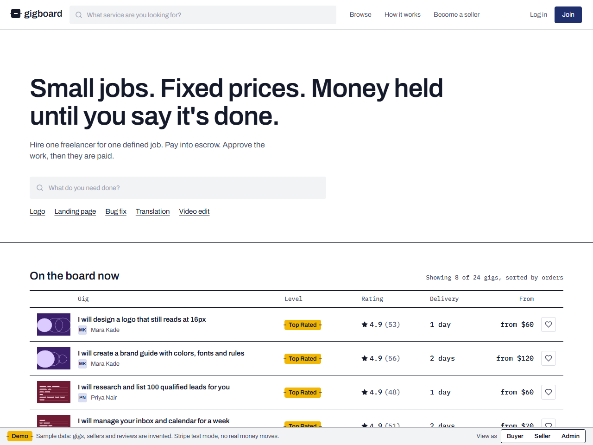
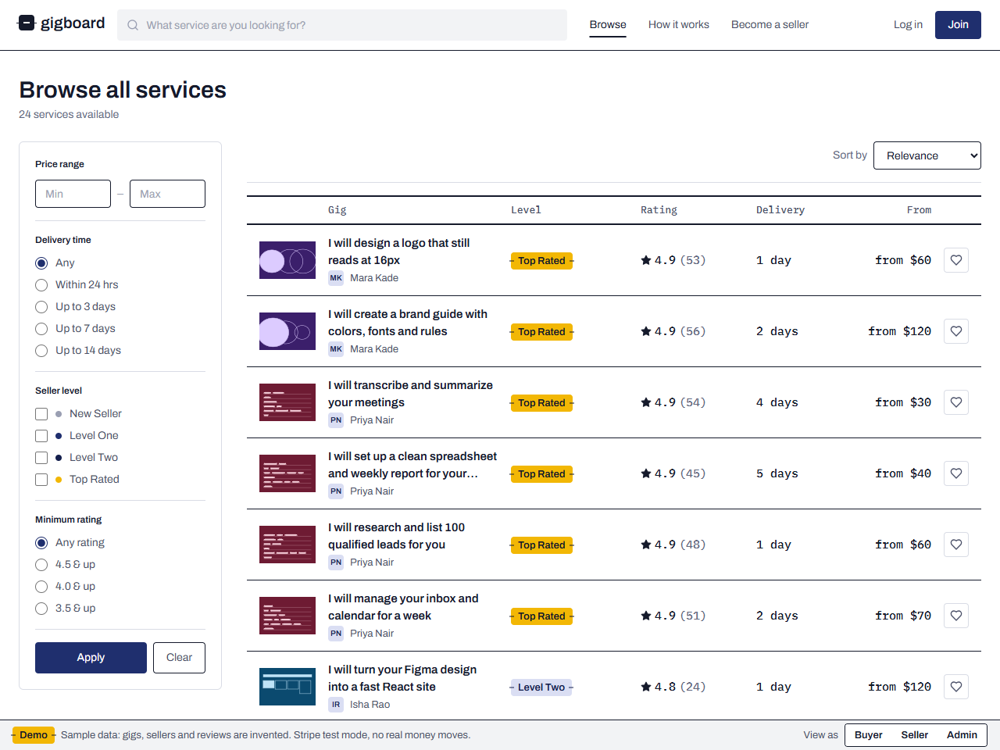
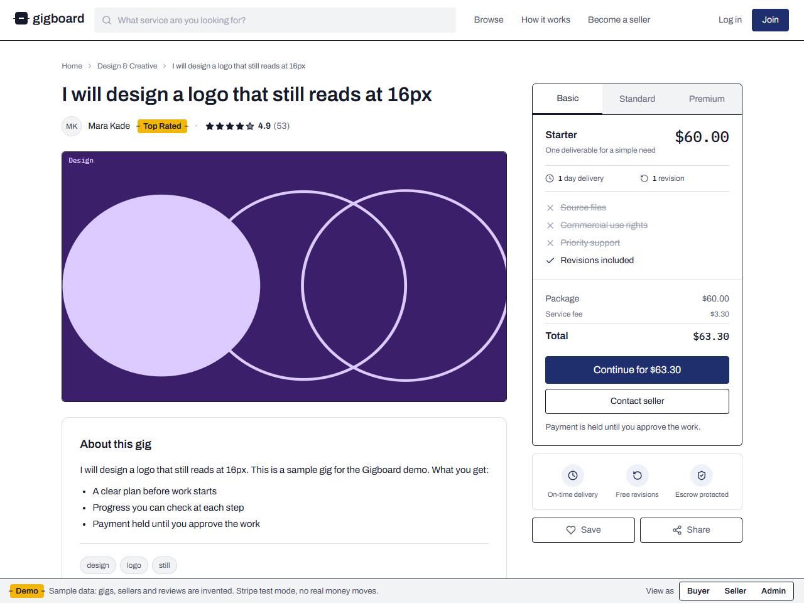
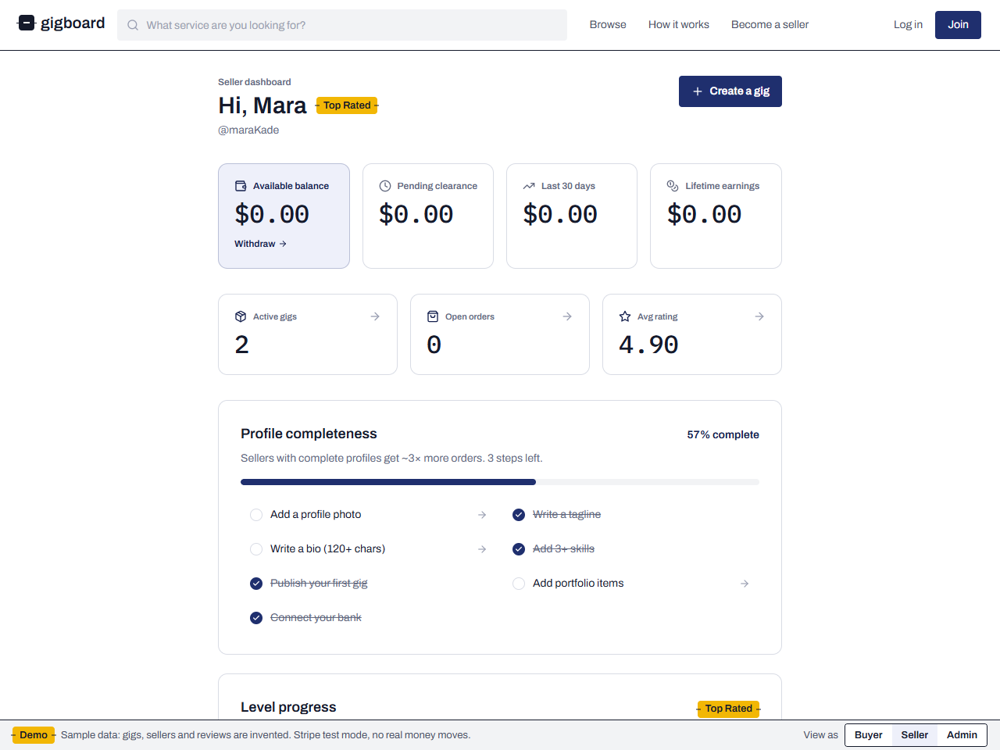
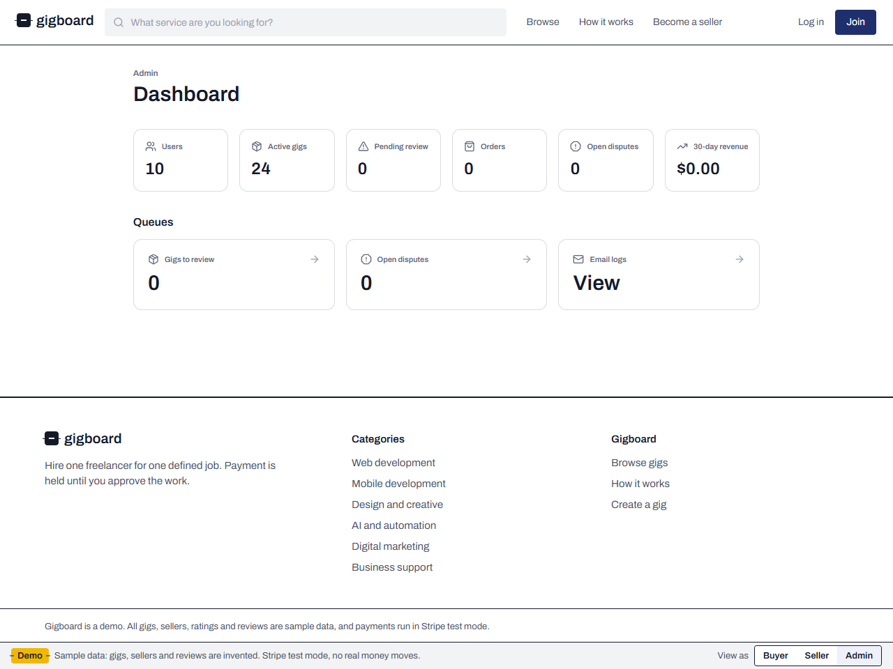

# Gigboard: freelance services marketplace

Hire one freelancer for one defined job. Sellers publish gigs with Basic, Standard and Premium packages. Buyers pay into escrow and approve the work before the seller is paid.

This is a demo. All gigs, sellers, ratings and reviews are sample data, and payments run in Stripe test mode, so no real money moves.

## Screenshots

## What it includes
- Search with category, price, delivery and seller-level filters
- Gig pages with three packages, add-ons and reviews
- Checkout in Stripe test mode with a fee breakdown
- Order tracking from ordered to approved, with revision requests
- Messaging between buyer and seller
- Seller dashboard with earnings and analytics, and a gig creation wizard
- Admin screens for gig review and disputes
- Scheduled jobs (Vercel Cron) for auto-completing orders, clearing funds and updating seller levels
- Gig covers drawn in code, one pattern per category, so the app needs no photos

## Stack
Next.js 14 (App Router, TypeScript), Tailwind, Supabase (Postgres, auth, storage, realtime), Stripe (test mode), deployed on Vercel.

## Setup

1. Install: `npm install`
2. Create a Supabase project. In the SQL editor, run `supabase/schema.sql`. Enable email and password sign-in.
3. Create a Stripe account and copy the test-mode keys.
4. Copy `.env.example` to `.env.local` and fill in the values.
5. Seed the sample data: `npm run seed` (needs `DEMO_PASSWORD` in `.env.local`).
6. Run: `npm run dev`

## Demo mode

Set `DEMO_MODE=true` and `NEXT_PUBLIC_DEMO_MODE=true` to show a strip at the bottom of every page. It says the data is sample data and lets a visitor sign in as a sample buyer, seller or admin in one click.

- It signs in to real sample accounts with the server-side `DEMO_PASSWORD`. Nothing bypasses authentication.
- The switch route answers 404 unless `DEMO_MODE` is exactly `true`, refuses cross-site requests and unknown roles, and never sends the password to the browser.
- Only turn it on for a deployment that holds sample data. Never enable it where real users or real data exist, because the admin account is one click away.

Sample accounts (created by the seed script, password is your `DEMO_PASSWORD`): `buyer@gigboard.test`, `mara@gigboard.test` (seller), `admin@gigboard.test`.

Stripe test card: `4242 4242 4242 4242`, any future expiry, any CVC.

## Tests

`npx tsx --test tests/audit.test.ts` runs the security regression tests: cron authorization, the sign-in redirect, webhook configuration and the demo switch guards.

## Fees
Seller commission 20%. Buyer service fee 5.5%, plus a $2.50 flat fee on orders under $50. Tips split 20% platform and 80% seller. All values are in the `platform_settings` table.

## Deploy
Push to GitHub, import the repository in Vercel, add the environment variables, set `NEXT_PUBLIC_APP_URL` to the deployed address, and deploy. `vercel.json` sets up the cron jobs.

## License
MIT
